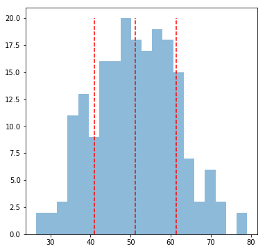

### Questions
* No questions....

### Objectives
YWBAT
* Interpret Skewness and Kurtosis equations
* define which parameters define specific distributions
* Measure normality on a dataset
* Define a poisson distribution 

### Key Takeaways
* understand how parameters define distributions
* apply distributions to solve problems

### Outline
* Discuss some distributions and their use cases
* Normal distribution measurements (skewness, kurtotis, jacque-bera)


```python
import pandas as pd
import numpy as np
import scipy.stats as stats

import matplotlib.pyplot as plt
```

### What is/are a parameter(s)?
From parameters we get an idea of how it looks

### Normal
**Parameters**
* $\mu$ - mean
* $\sigma$ - standard deviation

**Shape**
* Bell curve


**When**
* Looking at populations or samples from a populations

### Exponential Distributions
**Parameter**
* $\lambda$ - exponent - rate of decay/growth

**Shape**
* Exponential curve

**When**
* growth/decay
* physics 
* population
* inflation

### Poisson 
Parameter
* $\lambda$ - exponent - rate at k number events occur in some given time

Example:
* 15 people walk into a starbucks every 10 minutes between the hours of 6 am and 10 am.

    * $\lambda\$ = 15people/10minute

Shape
* exponential curve

When
* Time Series ? 
* counts over time
* earthquakes in a month
* floods in a month
* number of teens that go viral on instagram per month
* number of celebrities trending per day

### Binomial Distribution
Parameters
* p = probability of success
* q = (1 - p) probability of no success

Example
* Flipping a coin
* Getting a match on a swipe
* Getting a like on an interaction
* Catching a fish
* Winning on a lotto ticket

### Let's get into Normal Distributions
how do we measure normality?


```python
# let's make a random list of integers between 0 and 20
x = np.random.randint(0, 20, 100)
x.mean(), x.std()
```


    (9.99, 5.816347651232688)


```python
plt.figure(figsize=(6, 6))
plt.hist(x, label='x', alpha=0.5, bins=20)
plt.vlines(x=x.mean(), ymin=0, ymax=12, colors='r', linestyle='dashed')
plt.vlines(x=x.mean() + stats.kurtosis(x)*x.std(), ymin=0, ymax=12, colors='r', linestyle='dashed')
plt.vlines(x=x.mean() - stats.kurtosis(x)*x.std(), ymin=0, ymax=12, colors='r', linestyle='dashed')
plt.plot()
```


    []


### Measure the Skewness and Kurtosis


```python
skew = stats.skew(x)
kurtosis = stats.kurtosis(x, fisher=False)
skew, kurtosis

# skewness measures symmetry
# kurtosis measures tendancy around mean
# most points should fall within 3 std of mean
# kurtosis should be around 3
```


    (0.03834443137697264, 1.7922755476260055)


### get percentages for standard deviation ranges


```python
# what does this return?
for i in range(1, 5):
    num_points = np.where(abs(x) < (x.mean() + i*x.std()))[0].shape[0]
    print("points within {} standard deviations = {}".format(i, num_points/100))
    # tuple 
```

    points within 1 standard deviations = 0.76
    points within 2 standard deviations = 1.0
    points within 3 standard deviations = 1.0
    points within 4 standard deviations = 1.0


```python
(x.max() - x.min()) / x.std()
```


    3.266654804578821


### Let's make a normal dataset


```python
nx = np.random.normal(50, 10, 200)
nx.mean(), nx.std()
```


    (51.24410762979849, 10.21525296996087)


```python
plt.figure(figsize=(6, 6))
plt.hist(nx, label='x', alpha=0.5, bins=20)
plt.vlines(x=nx.mean(), ymin=0, ymax=20, colors='r', linestyle='dashed')
plt.vlines(x=nx.mean() + nx.std(), ymin=0, ymax=20, colors='r', linestyle='dashed')
plt.vlines(x=nx.mean() - nx.std(), ymin=0, ymax=20, colors='r', linestyle='dashed')
plt.plot()
```


    []





```python
skew = stats.skew(nx)
kurt = stats.kurtosis(nx, fisher=False)
skew, kurt
```


    (0.08121339275464987, 2.6319063868223505)


### Assessment

What does it mean to have a skewness close to 0?
* Balanced
* Symmetrical

What does it mean to have a kurtosis (pearson) close to 3?
* The distribution has the same kurtosis as a normal distribution
* Most of your data lies within 3 standard deviations from mean


Need both to measure normality!!!

Skewness close to 0

Kurtosis close to 3
