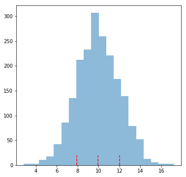

### Questions
* Exponential Distribution Mean

### Key Takeaways
* understand how parameters define distributions
* apply distributions to solve problems

### Outline
* Discuss some distributions and their use cases
* Normal distribution measurements (skewness, kurtotis, jacque-bera)


```python
import pandas as pd
import numpy as np
import scipy.stats as stats

import matplotlib.pyplot as plt
```

### What is/are a parameter(s)?
From parameters we get an idea of how it looks
Parameters define a distribution

### Normal Distribution
* Parameter(s)
    * $\mu$ - mean
    * $\sigma$ - standard deviation

* Use Cases
    * Almost all the time
    * Populations/Samples
        * Measure something on a population
        
### Binomial Distribution
* Use Cases
    * Coin Flips
    * Win vs Lose
    * This vs That
    * 2 independent events with some number of trials 
    
* Parameter(s)
    * $p$ - probability of success
    * $n$ - number of trials
    
### Poisson Distribution
* Use Cases
    * Measuring the rate of an event over a time interval
    * Event/Interval 
    * Defective phones/1000 phones

* Parameters(s)
    * $\lambda$ - rate of an event occuring

### Exponential Distributionf
* Use Cases
    * Growth and decay
    * How long until some event occurs
    * How long until an event decays to some value

* Parameters
    * $\lambda$ - rate of growth/decay
    

### Uniform Distribution
* Use Cases
    * Rolling a Dice
    * Picking a Card
    * Anything that has 'fairness'

* Parameters
    * $n$ - number of fair events

### Let's get into Normal Distributions
how do we measure normality?

* Mean, Median, Mode being equal...hmmm...this is great for symmetry, but misses the bell curve
* 65, 95, 99.7 test 1std, 2std, 3stds from the mean, checks the bell curve
* Skewness....
    * How well the data is distributed about the mean
    * How 'centered' the data is
    * which direction the data is stretched
* Kurtosis....
    * How fat/thin the tails are


```python
# let's make a random list of integers between 0 and 20
x = np.random.randint(0, 20, 100)
x.mean(), x.std()
```


    (8.77, 5.835846125456016)


```python
ostd = x.mean() + x.std()
mostd = x.mean() - x.std()
tstd = x.mean() + 2*x.std()
mtstd = x.mean() - 2*x.std()
plt.grid()
plt.hist(x, color='b', alpha=0.5, bins=20)
plt.vlines(x=x.mean(), ymin=0, ymax=14, linestyle='dashed', colors='r', linewidth=2, label=str(x.mean()))
plt.vlines(x=ostd, ymin=0, ymax=14, linestyle='dashed', colors='r', linewidth=2, label='1 std')
plt.vlines(x=mostd, ymin=0, ymax=14, linestyle='dashed', colors='r', linewidth=2, label='-1 std')
plt.vlines(x=tstd, ymin=0, ymax=14, linestyle='dashed', colors='r', linewidth=2, label='2 std')
plt.vlines(x=mtstd, ymin=0, ymax=14, linestyle='dashed', colors='r', linewidth=2, label='-2 std')
plt.legend()
plt.show()
```


```python
stats.skew(x)
```


    0.21313781521088626


```python
stats.kurtosis(x, fisher=False)
```


    1.8182735276812516


### Measure the Skewness and Kurtosis


```python
skew = stats.skew(x)
kurtosis = stats.kurtosis(x, fisher=False)
skew, kurtosis

# skewness measures symmetry
# kurtosis measures tendancy around mean
# most points should fall within 3 std of mean
# kurtosis should be around 3
```


    (0.21313781521088626, 1.8182735276812516)


### get percentages for standard deviation ranges


```python
# what does this return?
for i in range(1, 5):
    num_points = np.where(abs(x) < (x.mean() + i*x.std()))[0].shape[0]
    print("points within {} standard deviations = {}".format(i, num_points/100))
    # tuple 
```

    points within 1 standard deviations = 0.76
    points within 2 standard deviations = 1.0
    points within 3 standard deviations = 1.0
    points within 4 standard deviations = 1.0


```python
(x.max() - x.min()) / x.std()
```


    3.2557404002003785


### Let's make a normal dataset


```python
nx = np.random.normal(10, 2, 2000)
nx.mean(), nx.std()
```


    (9.953785908122375, 2.039472779419996)


```python
plt.figure(figsize=(6, 6))
plt.hist(nx, label='x', alpha=0.5, bins=20)
plt.vlines(x=nx.mean(), ymin=0, ymax=20, colors='r', linestyle='dashed')
plt.vlines(x=nx.mean() + nx.std(), ymin=0, ymax=20, colors='r', linestyle='dashed')
plt.vlines(x=nx.mean() - nx.std(), ymin=0, ymax=20, colors='r', linestyle='dashed')
plt.plot()
```


    []





```python
skew = stats.skew(nx)
kurt = stats.kurtosis(nx, fisher=False)
skew, kurt
```


    (0.009360004854058976, 3.057127225592856)


```python
stats.jarque_bera(nx) # h0 : nx is normal
```


    (0.30116322228408987, 0.8602075246242011)


```python
# Zscores
def zscore(arr):
    return (arr - arr.mean())/arr.std()
```


```python
nx1 = np.random.poisson(5, 1000)
nx2 = np.random.normal(100, 8, 1000)
```


```python
plt.figure(figsize=(8, 5))
plt.grid(zorder=-1)
plt.hist(nx1, bins=20, color='r', alpha=0.5)
plt.hist(nx2, bins=20, color='b', alpha=0.5)
plt.show()
```


```python
plt.figure(figsize=(8, 5))
plt.grid(zorder=-1)
plt.hist(zscore(nx2), bins=20, color='b', alpha=0.5)
plt.hist(zscore(nx1), bins=20, color='r', alpha=0.5)
plt.show()
```


### Assessment

What does it mean to have a skewness close to 0?
* Balanced
* Symmetrical

What does it mean to have a kurtosis (pearson) close to 3?
* The distribution has the same kurtosis as a normal distribution
* Most of your data lies within 3 standard deviations from mean


Need both to measure normality!!!

Skewness close to 0

Kurtosis close to 3
